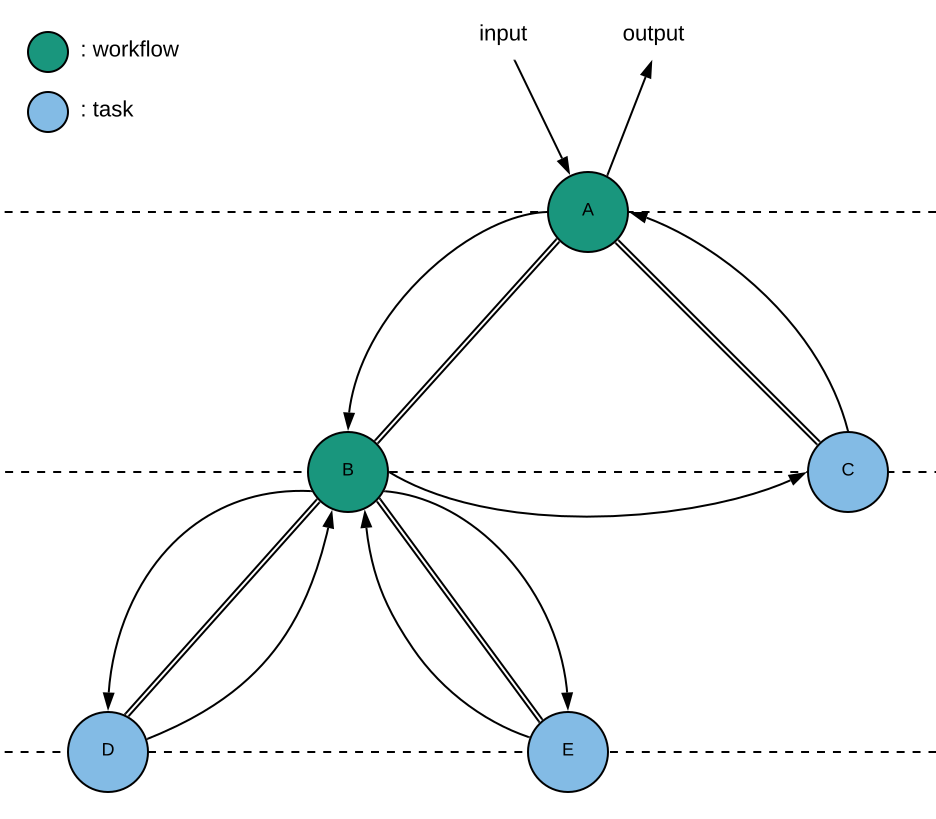
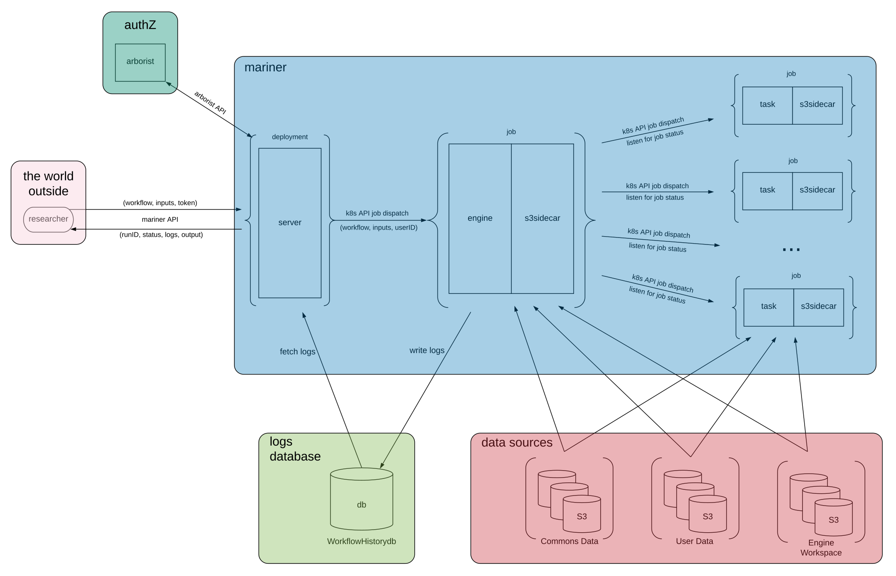

# mariner: the Gen3 workflow execution service

## Context 

### What are "workflows" and why should we run them?

A workflow is a partially ordered set of computations,
where the output of one computation may be the input of another computation,
while other computations may be independent of one another.

The computations are partially ordered because
if computation A takes as input the output of computation B,
then B has to run, and finish running, before A runs.
However, if computations A and B are not related via input/output (i.e., they are independent),
then A and B can run concurrently.

Bioinformatics at scale necessitates running workflows over massive amounts of data.
In order for Gen3 to be a more complete and useful cloud-based bioinformatics platform,
Gen3 needs the functionality to run these large scale workflows.  

#### Terminology Note 

In the context of bioinformatics, the terms "pipeline" and "workflow" refer to the same thing
and are often used interchangeably.

### What does it mean to "run a workflow"?

A workflow is specified in some workflow language.
Examples of workflow languages include [Common Workflow Language (CWL)](https://www.commonwl.org/)
and [Workflow Description Language (WDL)](https://software.broadinstitute.org/wdl/documentation/spec).
There exist many less prevalent workflow languages.
Hopefully eventually one workflow language will "win out" and become an actual standard.
In this first iteration of the workflow execution service, we will only support running workflows written in CWL.
CWL is basically a schema over YAML.
A [workflow](https://www.commonwl.org/v1.0/Workflow.html) consists of many CWL files,
where one file defines the top-level workflow,
and every other file defines either a subworkflow or a [tool](https://www.commonwl.org/v1.0/CommandLineTool.html) of that workflow.
The workflow execution service will handle "packed" workflows, which are workflows in JSON,
where all the CWL files for that workflow have been serialized into one JSON object.

So let's say you define a workflow in CWL.
In order to actually execute this workflow, you need to pass the CWL to some engine
which parses the CWL and then schedules and executes all the associated jobs.
The engine must be hooked up to some storage resource to store all the files generated during a workflow run.
The engine must also handle all the input/output dependencies among workflow steps,
including passing the output of one step to be the input of another step.

In particular, your workflow might consist of several containerized bioinformatics processes.
In this case, for a given containerized computation, the engine must pull the specified image
and run the computation in a container built from that image.

#### Examples of workflows written in CWL

[CWL User Guide Examples](https://www.commonwl.org/user_guide/02-1st-example/index.html) - this collection of examples (with an accompanying explanation for each example) covers all the basic features and syntax of CWL and is a truly great resource for learning the basics of CWL in a relatively small amount of time.  

[Genomel Workflows](https://github.com/uc-cdis/genomel_pipelines)  

[KidsFirst Workflows](https://github.com/kids-first?utf8=%E2%9C%93&q=workflow&type=&language=)  

Test Workflow
- [Workflow in CWL](https://github.com/uc-cdis/mariner/tree/feat/k8s/testdata/workflow/cwl)
- [Workflow in "Packed" CWL (JSON)](https://github.com/uc-cdis/mariner/blob/feat/k8s/testdata/workflow/workflow.json)
- [Input JSON](https://github.com/uc-cdis/mariner/blob/feat/k8s/testdata/workflow/inputs.json)

### Aren't there engines out there already that run workflows? Why did we write our own engine?

There do exist other workflow engines. Examples include [Cromwell](https://cromwell.readthedocs.io/en/stable/) and [cwltool](https://github.com/common-workflow-language/cwltool).

Reasons we wrote our own:
  - allow for seamless integration with kubernetes
  - extensible design to allow for simple integration with the rest of Gen3

## Workflow As Graph

A workflow may be represented as a graph, where  
- each vertex represents a workflow process, and
- edges between vertices represent the workflow-step relation between processes;  
the upstream vertex is the workflow and the immediately downstream vertex is a step of that workflow

Each vertex in the graph is either a leaf or not a leaf,
where a leaf is a vertex which has exactly one edge.
In workflow parlance, a vertex which is not a leaf represents a "workflow",
while a vertex which is a leaf represents a "task".
That is, a workflow has steps, while a task does not have steps
but is itself a computational step of some parent workflow.
So a workflow has edges to downstream vertices, while a task has no edges to downstream vertices,
and a task has a single edge which connects it to its parent workflow.

When mariner runs a workflow,
it first creates a graph representation of the workflow
and then recursively traverses the graph from the top down.
When mariner handles a particular vertex in the graph, the logic is this:
- if workflow, then resolve(workflow)
- else, dispatch(task)   

where to "resolve a workflow" means to handle all of its steps,
and to "dispatch a task" means to run that task as a job.

### Dependencies Between Steps; Job Scheduling

The steps of a workflow are all handled concurrently,
but a step will not actually run until the input for that step is available.

Input to a step comes from one (or both) of the following sources:
1. input of the parent workflow
2. output of another step of the parent workflow

For a workflow consisting of steps X and Y, we say there exists a dependency
between X and Y if X takes as input the ouput of Y.
Dependencies like this have implications for job scheduling
in that step X cannot run until step Y runs and finishes running.  

In the case where there is no dependency between steps X and Y (i.e., X and Y are independent),
then X and Y run concurrently.

### Example



This graph represents a workflow consisting of processes A,...,E.
Vertex A represents the top-level workflow,
which consists of steps B and C.
Step C is a task, while step B is itself a workflow consisting of steps D and E.

The arrows in the diagram indicate how inputs and outputs are passed between processes.
For workflow A, the input to step B comes from the input provided to the top-level workflow (A),
while the input to step C is the output of step B.
For job scheduling, this implies that task C will not run until workflow B runs and finishes running.

Workflow B consists of steps D and E, where D and E are tasks.
The input to both steps comes from the input provided to parent workflow B.
Notice that neither step takes as input the output of the other step,
which means that these steps are independent of one another.
For job scheduling, this implies that tasks D and E will run concurrently.

So when mariner runs the workflow represented by this graph, here's the sequence of events:  
- Handle workflow A
- Resolve workflow A
  - Concurrently handle steps B and C
  - Identify that the input of step C is the output of step B
  - Wait to run step C until step B has finished running
  - Resolve workflow B
    - Concurrently handle steps D and E
    - Dispatch tasks D and E to run concurrently
    - Listen for D and E to finish
    - Collect output from each step individually
    - Merge output from D and E into a single workflow B output object  
    - --- workflow B finishes ---
  - Pass output from step B to step C
  - Dispatch task C
  - Listen for C to finish
  - Collect output from C
  - Merge output from C into a workflow A output object
  - --- workflow A finishes ---
- Return workflow A output

## mariner API 

The core of the API will be the [GA4GH Workflow Execution Service (WES) API](https://github.com/ga4gh/workflow-execution-service-schemas).
Optionally we may implement extensions or additional functionality.
Do let me know if you have any ideas or thoughts on how the mariner API should be, what it should be able to do.

Endpoints:

`/service-info`
  - `GET`: get service information, currently supported workflow languages and versions, currently supported WES version

`/runs`
  - `GET`: list workflow runs (returns list of (runID, status) pairs)
    - it would be nice to differentiate between past and in-progress runs,
    so that a user can retrieve a list of only those runs which are currently in-progress
    - alternatively, retrieve a list of only those runs which have finished running
    - also a basic option which returns all runs, both completed and in-progress
  - `POST`: run a workflow; returns runID for the workflow job

`/runs/{runID}`
  - `GET`: get complete logs (including output JSON) for the given workflow run (i.e., full entry for that run from workflowHistorydb)
    - might be nice for there to be an endpoint/option for: get output of a successfully completed workflow run,
    which returns only the output JSON and none of the logs/stats/versioning information from the run.
    Unsure of the usefulness of a separate endpoint for this though, if the parent endpoint
    already returns the full entry from workflowHistorydb, which contains the output JSON.

`/runs/{runID}/cancel`
  - `POST`: cancel a workflow run which is currently in-progress

`/runs/{runID}/status`
  - `GET`: get status of a workflow run (complete | in-progress | failed)

## System Components

### mariner
  - `server`
    - listens for and handles API calls
    - upon authZ'd workflow request, dispatches engine job to run a workflow
    - the server may dispatch arbitrarily many engine jobs
  - `engine` (1 workflow <-> 1 engine job)
    - resolves workflow graph
    - manages input/output dependencies among workflow steps
    - schedules and dispatches workflow tasks as jobs
  - `task` (1 engine job <-> many task jobs)
    - runs a particular workflow tool
    - if image specified for the tool, the task runs in a container built from the specified image

### workflowHistorydb
  - stores logs of all workflow runs

### data components
  - data commons (input source)
  - user data (input source)
  - engine workspace (serves as an isolated working directory for a particular workflow run)

### auth
  - every call to the mariner API must include a token for auth
  - mariner passes token from API request to [arborist](https://github.com/uc-cdis/arborist) to check that user's privileges;
  only upon arborist's okay does mariner perform the requested action
  
## System Components Diagram


## How does it work? 

Prerequisite: an API token

To run a workflow, pass (workflow, inputs, token)
as the JSON body of a POST request to the mariner API `/runs` endpoint.  
See: [example request body](https://github.com/uc-cdis/mariner/blob/feat/k8s/testdata/request_body.json)

mariner will first check authorization for the user by passing the token
to arborist. arborist will check workflow privileges for the user
and return either "okay" or "not okay" for this user to run a workflow.

If the user is authorized to run workflows, then the mariner-server will dispatch
an instance of mariner-engine as a k8s job to run the workflow.
In this case the server returns a `runID` to the user to allow the user
to track status, retrieve logs, and eventually retrieve output of that workflow run.

mariner-engine resolves the graph of the workflow and
creates an input/output dependency map for all the steps of the workflow.
The engine uses the dependency map to schedule all the tasks of the workflow as k8s jobs,
where one task corresponds to one job.  

mariner-engine logs all events of the workflow run and incrementally writes these logs to workflowHistorydb.

The final output JSON of the workflow run gets written to workflowHistorydb.

The user can check the status of a workflow run by hitting the `/runs/{runID}/status` API endpoint,
where the status will be one of: `in-progress`, `complete`, `failed`.

At any point, the user can retrieve logs of any workflow run (i.e., regardless of run status) by hitting the `/runs/{runID}` endpoint.

Once a workflow run's status is `complete`, the user can retrieve the output JSON (along with the logs) of that workflow run by hitting the mariner API `/runs/{runID}` endpoint.

## Who has authZ to run workflows? 

Anyone with `admin` privileges can run workflows.

In the first iteration, Matt and some of the bioinformaticians and developers will have admin privileges for testing and running workflows internally.

## Logs, workflowHistorydb 

Logs are written to workflowHistorydb incrementally to allow for retrieval of logs
in the case where the workflow run fails at any point.
In particular, this incremental logging method allows for debugging a failed workflow run.

A complete record for a workflow run could be a JSON identified with key `/userID/runID/` consisting of fields:
- `status`
- `logs`
- `output`
- `stats`

Any thoughts on the workflowHistorydb (what kind of storage to use, how to organize the db) are welcome.

## The Engine Workspace 

A workflow run generates files, and workflow tasks may define and depend on particular directory structures
for their execution to run as intended.

Additionally, CWL spec mandates that each task must run in its own isolated container and workspace (i.e., directory)

For these reasons, when a workflow runs, the whole workflow run has its own workspace,
which is just a directory in a bucket.
And each task of that workflow also has its own workspace, which is just a subdirectory there.

Engine workspace bucket directory structure:
```
/userID/runID/
  task1/
    someFile
  task2/
  ...
```

During a workflow run, the workspace for that run is mounted (fuse mount via [goofys](https://github.com/kahing/goofys))
to the engine job as well as to each task job.

The bucket gets mounted at the `/userID/runID/` prefix,
so that user_1's engine workspace is not exposed to user_2's workflow run.
That is, mounting the engine workspace at this prefix 
prevents users from seeing or interacting with other users' data.

## Data Flow

mariner utilizes three data components:
  - commons data (input source)
  - user data (input source)
  - engine workspace
    - stores all files generated by workflow run
    - files generated by intermediate steps (stored here) may be used as inputs to later steps

Per workflow run, each data component is mounted to the engine job as well as to each task job.
mariner reads from commons-data and user-data, and reads/writes from/to engine-workspace.

### Where does input data come from?

When you submit a workflow execution request,
you must include a JSON which maps workflow input parameters to actual input values to use for execution.
Input parameters may be of different types, e.g., file, string, integer, boolean, etc.

Inputs of type `file` come from one of the following data components:
1. commons data
2. user data

Specify a commons data file by its GUID.
Commons data is made available to the workflow run via [gen3-fuse](https://github.com/uc-cdis/gen3-fuse).
  
User data are data files in the user-data-space (all files with `/userID/` prefix in the user-data bucket).
These files are specified via path relative to the `/userID/` prefix.
These files are made available to the workflow run via goofys fuse mount.  

An unaddressed use-case/open question:  
User has a large amount of data in their own bucket(s) somewhere, which may or may not be private/controlled-access.
User wants to run workflow using these data as input, without moving/staging the data to some user-data-space.

### What is the output of a workflow and where does it end up?

Every workflow defines a set of output parameters.
Output parameters, like input parameters, may be of different types: file, int, bool, string, etc.

Every workflow run results in a JSON object which maps output parameters to values.
Outputs of type `file` are specified by paths relative to the engine workspace for that workflow run (i.e., paths relative to  prefix `/userID/runID/`).

The output JSON object is written to workflowHistorydb.

All files generated during a workflow run are stored in the engine workspace,
and final output files are no exception.

So the final output files of a workflow run are stored in the engine workspace for that run, where that workspace is identified by prefix `/userID/runID/`.

### How do you retrieve the output of a workflow run?

To retrieve the output JSON (and all the logs) for a completed workflow run, hit the `/runs/{runID}` API endpoint.  

It's currently an open question as to how users would browse and retrieve data files generated by a workflow run.  

One idea:  
Create some service which allows users to access their 
  1. user-data-space
  2. engine workspace  
  
Present both of these entities as separate directories in one place
so that a user could browse, upload, download, delete files from their user-data-space
as well as browse and download files from their engine workspace, all in one place.

## Objectives for First Iteration

At the end of this next stage of development, it will be possible to
put this sequence of steps into a script:  
 
1. Define a cohort via graphQL query
2. Retrieve GUIDs for data files of cohort via graphQL query
3. Create the inputs JSON map for a workflow using GUIDs to specify commons file inputs.
4. POST (workflow, inputs, token) to mariner API `/runs` endpoint to run the workflow
5. Listen to run status via `/runs/{runID}/status` endpoint
6. When status is "complete" or 'failed', retrieve complete execution logs (including output JSON of a successfully completed run) via GET `/runs/{runID}`  

Viewing and retrieving files from the engine workspace would be done "manually"
via the AWS CLI until a solution for this situation is figured out.

The WES API will be completely implemented, and all of mariner's API will be secured via arborist.

There will be no UI yet - all steps of the workflow execution process happen via interacting with the mariner API.

Workflows will only be run internally - that is, workflows will not be a feature available for commons users to use.

Per commons, there would be
- one bucket to serve as the engine workspace
- one bucket to serve as the user-data-space (interal users only)
- one bucket to serve as the workflowHistorydb

Input files could come from either the commons or staged (via the AWS CLI) to the user-data-space.
Commons files are specified by GUIDs, while user files are specified by path relative to that user's prefix in user-data-space bucket.

### What do we have right now?

Right now we don't really have a workflow execution service per se, but we do have a prototype workflow engine.
The engine was developed working with a [test workflow](https://github.com/uc-cdis/mariner/tree/feat/k8s/testdata/workflow/cwl) which is basic but does include step dependencies
and the [scatter](https://www.commonwl.org/v1.0/Workflow.html#WorkflowStep) CWL feature.  
  
So we have an engine which can run workflows written in CWL. Some non-basic features of CWL are currently
not supported, such as the [schemaDef requirement](https://www.commonwl.org/v1.0/Workflow.html#SchemaDefRequirement)
and [$import and $include](https://www.commonwl.org/v1.0/Workflow.html#Document_preprocessing) statements.  

So job scheduling, concurrency, handling step dependencies, passing i/o between steps, parsing CWL,
handling javascript in CWL, resolving the workflow graph, dispatching tasks, collecting output,
having a server that listens for requests and dispatches engine jobs to run workflows which in turn
dispatch task jobs to execute workflow tasks - we already have these things.
Of course these things need to be tested against many different workflows of varying size and complexity,
but the core of these things has already been implemented and will only need to be refined moving forward.

### What are next steps?

Here are important things that need to happen next:
- Capture structured level logs for a workflow run
- Implement workflowHistorydb
- Use gen3-fuse to serve commons data as input to a workflow
- Implement user-data-space (or at least a single bucket to serve this purpose in this first iteration)
- Build out the complete WES API
- Secure API via arborist

#### Timeline?

Unfortunately this is a very hard thing to reliably predict, but here's an attempt:
- By the end of September:
  - capture structured logs
  - implement workflowHistorydb
  - build out half of WES API
- By the end of October: 
  - build out second half of WES API
  - secure API via arborist
  - implement basic version of user-data-space
- By the end of November:
  - implement gen3-fuse to serve commons data to workflow run
  - deploy mariner to some commons' test or staging environment for testing real workflows on real data  
  
## Open Questions 

1. How will users browse and download output files from a workflow run?
That is, how will users access their engine workspace for a particular run?
2. What should the user experience be like for the user-data-space?
3. What functionality/endpoints (in addition to the WES API) should the mariner API have?  

## Examples of other workflow execution services and otherwise relevant resources

[Toil](http://toil.ucsc-cgl.org/) is UCSC's pipeline management system.   

[How IBM uses Toil](https://developer.ibm.com/storage/2017/05/04/cwl-workflow-lsf-toil/) to run CWL workflows on IBM Spectrum LSF cluster.

[Rabix](https://rabix.io/) is an open source graphical editor which enables visual programming in CWL.

[Dockstore](https://dockstore.org/) is an open platform used by the GA4GH for sharing Docker-based tools described with the Common Workflow Language (CWL), the Workflow Description Language (WDL), or Nextflow (NFL). 

[Firecloud](https://firecloud.terra.bio/) lets you run workflows in a [workspace](https://support.terra.bio/hc/en-us/articles/360022716811), which is basically a dataset and collection of analysis tools wrapped into a unit.

[Arvados](https://arvados.org/) is an open source platform for managing compute and storage for cloud and HPC clusters.
You can [use the Arvados Workbench to run a workflow](https://doc.arvados.org/v1.4/user/tutorials/tutorial-workflow-workbench.html). 

[Galaxy](https://usegalaxy.org/) is another open source platform for data intensive biomedical research,
which has a library of tools and workflows that you can pick from to compose your own workflow in a visual workflow editor. 

[Seven Bridges](https://www.sevenbridges.com/platform/) has a pretty fully formed workflow execution service.  
See also: [Cavatica](http://docs.cavatica.org/docs/getting-started)  

Seven Bridges also has a [library of CWL workflows and tools](https://igor.sbgenomics.com/public/apps/?__hstc=64521200.1c372e320068fc5c77fb422e9312dd18.1565808892437.1566507563181.1567095819982.4&__hssc=64521200.7.1567095819982&__hsfp=3244085210) that you can mix and match to create your own workflow.  
  
[Seven Bridges quickstart](https://docs.sevenbridges.com/docs/quickstart) for running a workflow on their platform.  

["A Review of Bioinformatic Pipeline Frameworks"](https://academic.oup.com/bib/article/18/3/530/2562749)
is a highly relevant journal article which provides additional context and helps
elucidate the current state of affairs regarding workflow execution systems.
